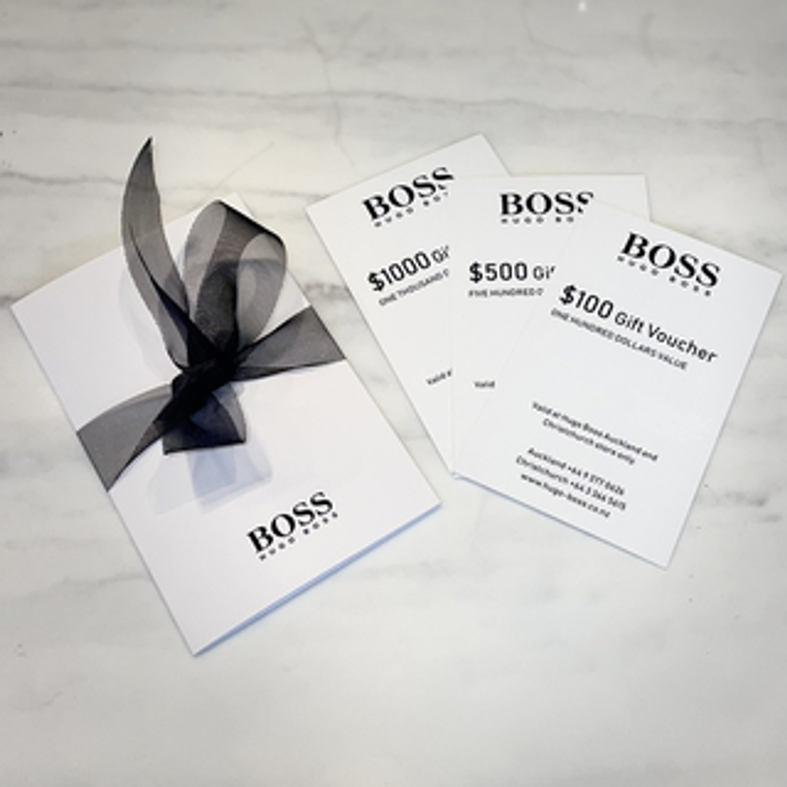

This 6-month project, spearheaded by me as a software integration developer, alongside a business analyst and project owner, transformed the brand's customer engagement strategy. We seamlessly integrated a bonus system rewarding frequent purchases. We also implemented personalized gift certificates, boosting holiday sales. To streamline operations, we adjusted the POS system and established a bi-directional exchange with their SAP ERP. The project's exceptional success was recognized by business consulting company that I used to work at that time, who presented us a special achievement award at their monthly meeting. This experience honed my ability to lead complex integrations, troubleshoot technical challenges, and collaborate effectively with stakeholders to deliver game-changing results.
