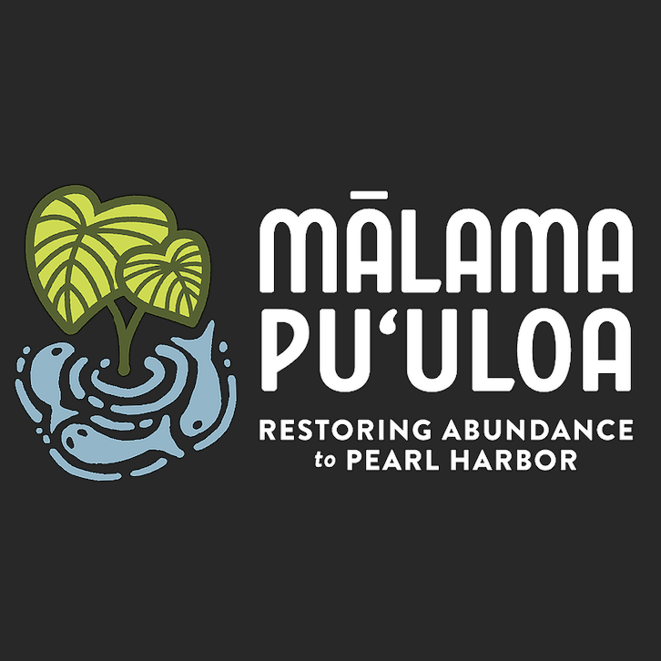

Last summer I participated in volunteering program called Mālama Pu`uloa.  
We prepared the site on the bike path and planted fruit trees.

More info: <a href="https://www.malamapuuloa.org/">malamapuuloa.org</a>
