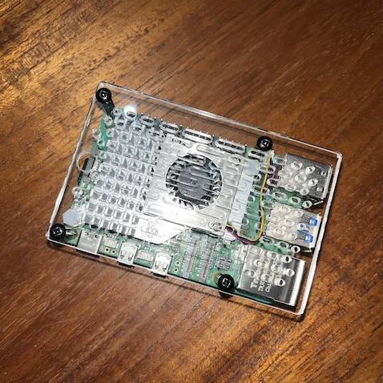

  

This is my ongoing project.
The Raspberry Pi's compact size (about the size of a credit card) packs a powerful punch.
This affordable, low-power single-board computer is a nearly ideal developer board, 
pairing well with a variety of sensors like temperature and pressure sensors, 
as well as wheels, actuators, solenoids, and motors. I'm planning to experiment with building a stand-alone LLM system using Python libraries 
like TensorFlow and NumPy to interact with the hardware and maybe prototype something truly unique. 
If paired with a 3D printer it opens a wide road of project possibilities.  The question left is: where to find free time for it...
