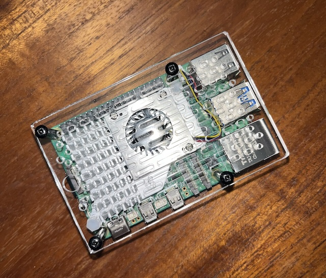

 This is my ongoing hobby project. The Raspberry Pi's compact size (about the size of a credit card) packs a powerful punch. This affordable, low-power single-board computer is a nearly ideal developer board, 
pairing well with a variety of sensors like temperature and pressure sensors, actuators, solenoids, and motors. I'm planning to experiment with building a stand-alone LLM system using Python libraries like TensorFlow and NumPy to interact with the hardware and maybe prototype something truly unique. 
If paired with a 3D printer it opens a wide road of project possibilities. I migth use it for my future research purposes in the university.
One of my 'idea fixe' is to build a fly zapper that would use a camera and microphone to detect insects and neutralize them with an ultrasound.
