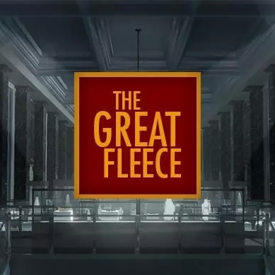

<a href="https://assetstore.unity.com/packages/templates/tutorials/the-great-fleece-110186">“The Great Fleece” is a stealth, point & click adventure game with engaging cutscenes created with Timeline & Cinemachine."</a>

This learning experience was about one month long. I developed Unity 3D skills: Stealth Game & Cinematography, 2.5D Game Development, working with audio, Unity C# application, Git.

Try this game in Google Chrome: <a href="https://gordeevd.github.io/The-Great-Fleece/"><i class="large github icon "></i>gordeevd.github.io/The-Great-Fleece</a>
Detailed log of my internship: <a href="https://medium.com/@dmitry-cq"><i class="large medium icon "></i>medium.com/@dmitry-cq</a>
